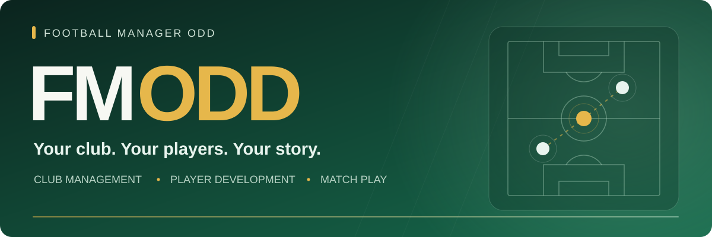
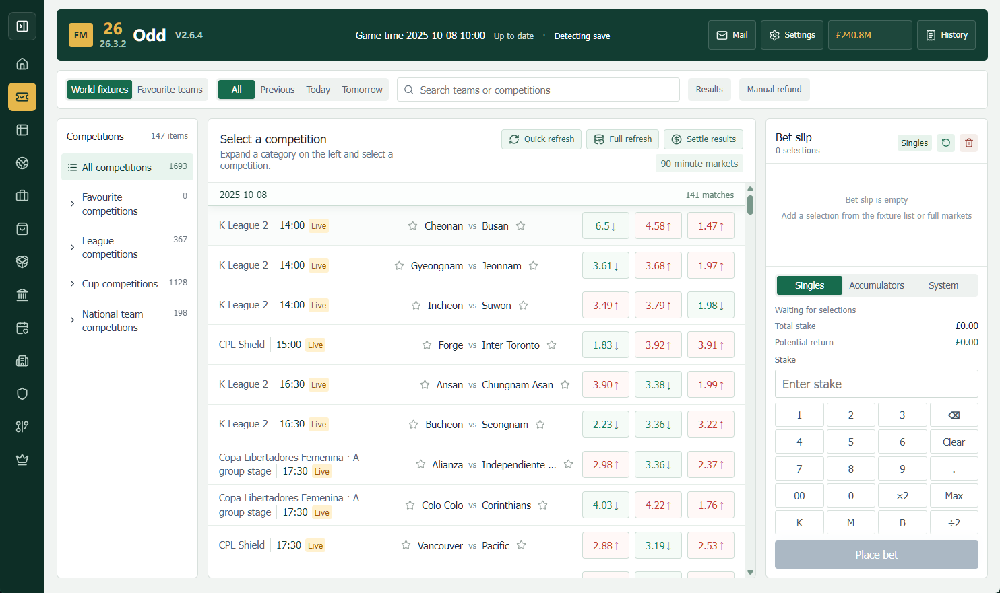

# Football Manager ODD

**把俱乐部经营、球员成长与比赛玩法，带进你的 FM 生涯。**

A Windows companion for Football Manager, built around clubs, players and the stories you create.

**[下载 Windows 版本](https://fmodd.com/download)** &nbsp; · &nbsp; **[查看发布版本](https://github.com/Kasnm1/football-manager-ODD/releases)** &nbsp; · &nbsp; **[反馈问题](https://github.com/Kasnm1/football-manager-ODD/issues)** &nbsp; · &nbsp; **[支持作者](https://fmodd.com/donate)**

---

## 让一段生涯，多一些值得经营的事

FMODD 是一个围绕 Football Manager 生涯展开的本地桌面项目。你可以经营旗下俱乐部、安排球员训练与球队活动，在比赛之外管理资金和人员，也可以保存球员的成长轨迹、比赛时刻与人物关系。

这些功能围绕当前存档和游戏日期运行。比赛玩法使用 ODD 虚拟资金；部分俱乐部、人员和训练操作会在版本校验通过后影响 FM 的原生数据。功能可用性以当前游戏版本与平台的实际检查为准。

## 六个方向，连接你的足球世界

<table>
<tr>
<td width="50%" valign="top">
<h3>01 · 集团经营</h3>

从世界俱乐部目录寻找目标，收购并管理旗下俱乐部。查看财政、设施与人员，把多个俱乐部放进同一个经营视野。

</td>
<td width="50%" valign="top">
<h3>02 · 球员成长</h3>

安排训练器材、位置训练、教练进修与青训计划。用训练档案记录变化，查看球员和团队一步步成长的过程。

</td>
</tr>
<tr>
<td valign="top">
<h3>03 · 比赛玩法</h3>

查看赛程、赔率、实时盘口、积分榜与冠军盘。配合 ODD 虚拟钱包、投注记录和结算，把比赛日接入自己的经营循环。

</td>
<td valign="top">
<h3>04 · 球队生活</h3>

通过活动中心、食堂和医院安排娱乐、心理辅导、饮食与医疗任务。球员和职员的状态、互动与关系都有各自的记录。

</td>
</tr>
<tr>
<td valign="top">
<h3>05 · 球员离队</h3>

为旗下球员寻找下家，从卡片式模拟报价中选择买家。接受报价后，所得转入球员原俱乐部的转会预算。

</td>
<td valign="top">
<h3>06 · 生涯记忆</h3>

在名人堂中持续关注人物，保存属性轨迹、比赛时刻、伤病与转会记录。借助关系网和时间线，留下这段生涯的故事。

</td>
</tr>
</table>

## 看看 FMODD 的样子

### 比赛与赔率界面

截图来自 V2.6.4，用于展示界面风格；当前版本的布局与功能以实际程序为准。

<strong>展开活动中心场景美术</strong>

 

项目中的活动中心场景美术展示。

## V2.7.0beta · 给球员寻找新的去处

活动中心 **2F「球员离队」** 将球员选择放在右侧，与其他活动保持一致；点击「为球员寻找下家」后，弹出卡片式买家选择窗口。

- 覆盖旗下俱乐部的可用球员，点击后才生成报价，最多提供五家买家。
- 买家选择参考球员声望与年龄，并排除已收购和正在执教的俱乐部。
- 使用当前存档的可用球员样本进行 **ODD 估值**，报价卡片展示俱乐部、赛事和金额。
- 接受前确认转会；成交所得计入**卖方俱乐部转会预算**。

这些报价由 FMODD 随机模拟，**不是 FM 原生球队主动发来的转会报价**。

## 开始使用

1. 前往 **[官网下载页](https://fmodd.com/download)** 获取 Windows 版本。
2. 启动 Football Manager，进入你希望使用的存档。
3. 启动 FMODD，选择匹配的游戏版本并连接当前存档。
4. 从集团、训练、活动或比赛入口开始体验。

涉及原生数据修改的功能，首次使用前先备份游戏存档。Beta 版本的兼容性和功能会继续调整。

| 环境 | 当前范围 |
| --- | --- |
| 操作系统 | Windows 桌面程序；macOS 尚未提供正式运行版本 |
| 游戏代际 | FM24 / FM26；使用各自的版本布局与能力检查 |
| 发行平台 | Steam / Epic / XGP 按具体 build 校验，功能覆盖可能不同 |
| 界面 | 多语言、显示偏好与字号设置 |
| 当前版本 | **V2.7.0beta** |

精确兼容性、功能边界与技术说明见 **[产品详情](docs/PRODUCT_GUIDE.md)**。

源码使用方式见 [开发手册](DEVELOPMENT.md)。公开仓库提供开发版，不包含 EXE 打包脚本、配置或教程。

## 一起把项目做得更好

欢迎提交功能建议、复现问题、改进翻译、修复代码，或分享你的玩法。小而完整的贡献也有价值。

| 想参与什么 | 从这里开始 |
| --- | --- |
| 报告问题或提出建议 | [Issues](https://github.com/Kasnm1/football-manager-ODD/issues)；附版本、平台和复现步骤 |
| 提交代码改进 | Fork → 修改 → Pull Request；详见 [贡献说明](CONTRIBUTING.md) |
| 理解代码结构 | [文档导航](docs/README.md)、[架构](docs/ARCHITECTURE.md)、[功能索引](docs/FEATURE_INDEX.md) |
| 在本机开发 | [开发手册](DEVELOPMENT.md)，包括原生核心准备与开发版运行 |
| 支持持续开发 | [支持作者](https://fmodd.com/donate)，按自己的意愿参与 |

维护者按精力处理反馈与 PR，不承诺即时回复或固定更新频率。感谢每一位愿意测试、贡献和支持项目的人。

<strong>For international contributors</strong>

FMODD adds club management, player development, team activities, simulated departure offers and career records to a Football Manager save. Match features use an ODD virtual wallet. Native game operations depend on the exact build and platform.

Windows is the current runtime platform. Download the application from [fmodd.com](https://fmodd.com/download), or explore the source and submit a focused pull request. Include the FMODD version, exact game build, distribution platform, reproduction steps and test results in bug reports. Never attach private saves, credentials or proprietary game/editor binaries.

---

### 许可与项目身份

本次公开暂未添加开源许可证，维护者保留其原创代码的权利；公开可见不代表获得任意再分发或商用许可。第三方材料遵循各自条款，见 [THIRD_PARTY_NOTICES.md](THIRD_PARTY_NOTICES.md)。

FMODD 是社区制作的非官方项目，与 Sports Interactive、SEGA 或 FMRTE 不存在官方隶属关系。Football Manager 及相关商标属于各自权利人。

**Football Manager ODD · Built for the stories you create.**

[官网](https://fmodd.com) &nbsp; / &nbsp; [下载](https://fmodd.com/download) &nbsp; / &nbsp; [贡献](CONTRIBUTING.md)

