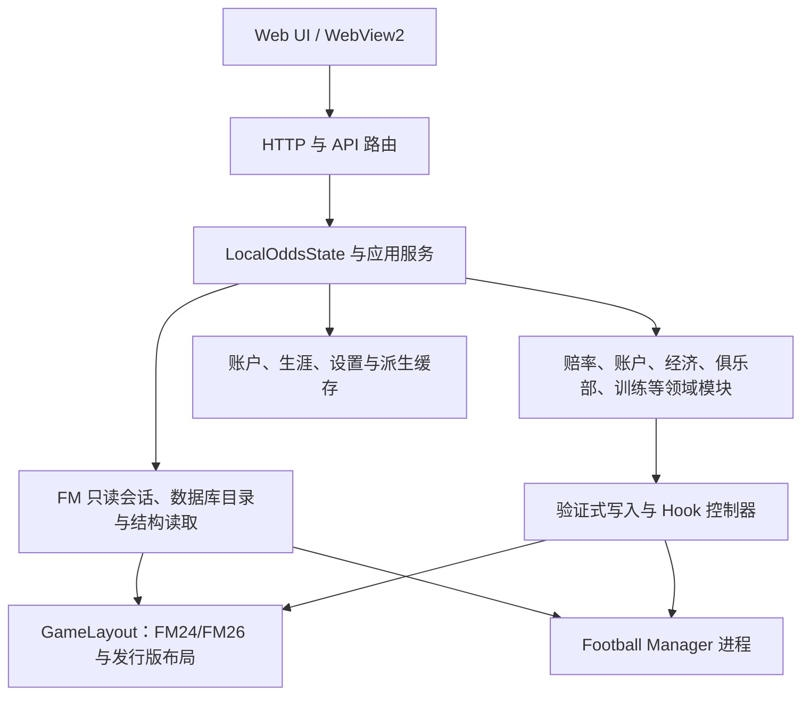

# FMODD 架构与代码路由

本文是 FMODD 的首读架构索引：回答系统怎样分层、某类改动由哪个模块负责，以及修改后应核对哪些边界。详细运行时规则见 [`RUNTIME_CONTRACTS.md`](RUNTIME_CONTRACTS.md)；赔率、盘口、投注与结算见 [`ODDS_ARCHITECTURE.md`](ODDS_ARCHITECTURE.md)；偏移、AOB、Hook 和上游证据见 [`RESEARCH_SOURCES.md`](RESEARCH_SOURCES.md)。

代码和测试是行为真值。本文用于路由，不把一次性实验、版本历史或完整产品说明重复写进来。

按“银行、训练场、名人堂”等用户功能名称找代码时，可先查 [FEATURE_INDEX.md](FEATURE_INDEX.md) 的对应条目；已有明确文件/函数时直接定位。功能索引不取代本文的模块所有权。

## 1. 系统分层

核心边界：

1. `game_layout`、读取层和原生核心负责证明“从哪个版本、哪个对象、哪个字段读取或写入”。
2. 领域模块负责业务语义，不拥有跨版本地址真值。
3. `LocalOddsState` 和应用服务负责编排、锁、作用域与 API 状态，不应继续吸收可独立测试的领域逻辑。
4. 前端负责展示与交互；余额、赔率、结算、风控和写入校验始终以服务端为准。

## 2. 启动与请求入口

| 入口 | 职责 |
| --- | --- |
| `fm_odds_web.py` | 本地 HTTP 服务、`LocalOddsState` 门面、共享运行时启动和薄 API 入口 |
| `tools/api_routing.py` | 精确路由注册与分派 |
| `tools/state_publication.py` | 单槽、短时公共快照合并与构建串行化；只接收上下文键和构建函数，不拥有账户或 FM 真值 |
| `tools/state_patches.py` | HTTP 修改请求的来源上下文校验与纯响应字段投影；不读写账户、不执行业务操作 |
| `tools/sponsorship_payment.py` | ODD 赞助付款与原生结余之间的意图记录、写后验证、提交和恢复顺序；原生能力与存储由窄 I/O 接口提供 |
| `tools/domain_errors.py` | 稳定领域错误码、阶段和可重试信息 |
| `tools/local_state_services.py` | 刷新协调与附属归档编排；`ClubLegacyRefreshCoordinator` 串行合并球队资料发布后的名人堂附属任务；兼容导出账户服务 |
| `tools/account_application.py` | 账户、商店与钱包用例；通过显式 `AccountOperation` 使用绑定账户的操作保护和响应能力，不直接持有运行时宿主 |
| `tools/refresh_status.py` | 轻量刷新状态的上下文绑定快照；拥有独立副本，未知或不匹配上下文不复用缓存字段 |
| `fmodd_desktop.py` | 冻结桌面入口与本地服务生命周期 |
| `desktop/WebViewHost.cs` | WebView2 窗口、宿主生命周期和桌面行为 |

开发版由 `fm_odds_web.py` 直接提供 `web/` 与 `/api/*`。正式版由 `fmodd_desktop.py` 启动同一共享运行时，再交给 WebView2 宿主显示。两条入口必须复用相同的连接、监控、结算和关闭语义。

JSON 业务路由以 `build_api_routes()` 注册表为唯一分派来源；`Handler` 不再保留注册表之后的同路径业务分支。二进制球员头像、静态资源回退、请求解析与通用错误边界仍由 `Handler` 处理；开发专用接口的 `FROZEN` 门禁在注册时保留。

## 3. 模块所有权

### 3.1 FM 身份、会话与读取

| 模块 | 所有权 |
| --- | --- |
| `tools/game_layout.py` | FM24/FM26、Steam/Epic/XGP 的模块身份、RVA、vtable、字段和能力布局 |
| `tools/game_session.py` | 常驻只读进程句柄、模块身份和会话代际 |
| `tools/database_index.py` | Club、Competition、Nation、Person、Stadium、Team 等原生对象目录 |
| `tools/initial_data_audit.py` | 核心对象、赛程、赛果和事件解析 |
| `tools/refresh_memory_core.py` | 赛程/赛果池发现、结构校验、同 slab 补全和有界回退扫描 |
| `tools/club_reader.py` | 经理、俱乐部、球员、职员读取，以及属性、伤病和不可用状态等通用原生事务入口 |
| `tools/player_details_fm24.py`、`tools/player_details_fm26.py` | 各代球员、合同和扩展资料布局 |
| `tools/player_name_localization.py`、`tools/player_aliases.py` | 按稳定 UID 解析安装目录 `.lnc`，加载封装版内置 XML 合并字典，并以后备方式读取用户文档目录的 FM 编辑器人员汉化 XML；完整映射未命中时按无歧义姓名片段、精确全名模板和离线保守音译依次兜底，日籍球员仅使用可靠汉字映射并按姓前名后显示；显示设置关闭“球员汉化”时恢复 FM 原名，不重排姓名或添加分隔符；在用户自定义别名之前统一处理球员显示名 |

新增 FM 字段先进入 `GameLayout` 与对应读取模块。业务模块只消费已校验结果，不直接复制偏移或跨版本地址。

### 3.2 赔率、投注与赛事

详细数据流、所有权和测试路由统一见 [`ODDS_ARCHITECTURE.md`](ODDS_ARCHITECTURE.md)。首要模块为：

| 领域 | 所有者 |
| --- | --- |
| 赛程、画像、xG、单场盘口 | `tools/preview_cup_odds.py` |
| 阵容与近期赛果的纯球队画像 | `tools/odds_profiles.py`；只接收已读取事实，原 `team_profile` 门面保留按需读取与缓存调用兼容 |
| 纯概率与亚洲盘数学 | `tools/odds_math_core.py`、`tools/rust_native_core.py`、`fmodd_native_core` |
| 赛果证据身份与明细一致性 | `tools/result_evidence.py`；不读取 FM、不持久化历史，也不生成赔率 |
| 生涯赛果历史账本 | `tools/result_history.py`；拥有读取、冲突合并、保留、备份恢复与原子保存；`preview_cup_odds` 保留原签名兼容入口 |
| 实时盘口 | `tools/live_market.py` |
| 钱包、注单、退款、派彩 | `tools/betting_account.py`、`tools/money.py`、`tools/pass_methods.py` |
| 积分榜、ELO、冠军盘 | `tools/league_standings.py`、`tools/championship_odds.py` |
| 异常投注与处罚 | `tools/match_integrity.py` |
| 赛季预测归档 | `tools/season_ledger.py` |

积分榜公共投影由 `tools/league_standings.py` 负责，限定为绑定完整语义依赖键的有界 LRU 派生缓存；冠军盘口的市场价格与快照缓存仍由 `tools/championship_odds.py` 按市场版本管理。两者都不能缓存积分/冠军事实、钱包或结算副作用，也不能改变唯一冠军判定、下注重定价和结算链路。

### 3.3 账户、经济与持久化

| 模块 | 所有权 |
| --- | --- |
| `tools/club_economy.py` | 银行、工资、贷款、商店、库存、活动/医疗账户状态，以及银行与钱包统一账本的只读公共投影 |
| `tools/save_context.py` | 生涯、经理账户、存档证据和历史账户选择 |
| `tools/app_paths.py` | 开发版与冻结版数据路径 |
| `tools/app_settings.py` | 用户设置与读取范围 |
| `tools/global_statistics.py` | 全局使用时长，以及基于已登记账户的跨存档投注统计只读投影 |
| `tools/storage_io.py`、`tools/storage_*.py` | 原子存储、锁、迁移、保留与空间管理 |
| `tools/update_rewards.py` | 应用版本奖励批次与领取幂等性 |

余额、库存、交易、贷款和账户文档是易变真值，不得因状态轮询性能优化而用无版本约束的长期缓存替代。可缓存的只能是完整语义键下的纯派生投影，并必须定义容量与失效条件。

### 3.4 俱乐部、人员与经营

| 领域 | 所有者 |
| --- | --- |
| 世界俱乐部、收购和出售 | `tools/world_clubs.py` |
| 集团人员批量读取 | `LocalOddsState.owned_world_club_group_people` → `tools/world_clubs.py::read_native_world_club_group_people` → `tools/club_reader.py::_scan_staff_for_teams`；一次只读会话、按队读取球员、共用职员候选遍历 |
| ODD 设施升级、出售与品牌推广报价规则 | `tools/club_operation_quotes.py`；纯计算，不扣费、不读写 FM，原服务入口保留兼容导出 |
| ODD 模拟赞助招商与合同 | `tools/club_sponsorship.py`；`fm_odds_web.py` 编排联赛余额报价、邮件和可选原生结余入账 |
| 俱乐部人物库与名人堂 | `tools/club_legacy.py`；FM26 build-gated 当前赛季统计由 `tools/player_details_fm26.py` 读取并随去地址球员快照持久化；本地 FM graphics 头像 UID 映射由 `tools/player_portraits.py` 提供 |
| 转会预算 | `tools/transfer_budget.py` |
| 球员/职员移动、租借与主教练事务 | `tools/player_movement.py` |
| 未来转会只读状态 | `tools/future_transfers.py` |
| 经理记录 | `tools/manager_record.py` |
| 玩家执教俱乐部历史转会投影 | `tools/transfer_history.py`；FM26 精确 Steam build 与 FM24 精确 Epic build 的原生归档读取复用 `tools/future_transfers.py` 的 TransferManager 定位和各自版本门禁，永久人物事实与人工补录金额仍分别由 `tools/club_legacy.py` 的生涯/经理账户容器持有 |
| 俱乐部关系 | `tools/club_affiliations.py` |
| 董事会愿景 | `tools/club_vision.py`、`tools/board_listens_hook.py` |

世界俱乐部的规范化目录、地区分面、同名消歧、声望排名和分页索引由 `tools/world_clubs.py` 负责；`LocalOddsState` 只编排存档/账户作用域与单实例派生缓存。目录中的地址始终只是会话提示，收购报价、成员核验和所有原生写入仍须走目标读取与事务校验，不能把目录投影当作 FM 地址或账户真值。`tools/database_index.py` 提供 FMRTE 风格的会话级 Team/Club/Nation 对象重定位：优先按稳定 UID 取得当前地址，随后校验 Team/Club vtable 与 Team→Club 关联；预备队/B 队的 Club UID 可与 Team UID 不同，不能用该相等关系误拒绝合法对象。索引暂时不可用时才使用已验证的调用方地址，不持久化裸地址。

### 3.5 训练、青训、活动与医疗系统

| 领域 | 所有者 |
| --- | --- |
| 训练设施、任务、楼层与公共投影 | `tools/training_ground.py` |
| 训练结算期间的队伍索引和对象回绑 | `tools/training_runtime.py` |
| 关系综训房间规则与专项进度 | `tools/relationship_training.py` |
| 版本化训练档案、关系摘要索引与关系时间线 | `tools/training_archive.py` |
| 双向人物关系读取、保类别写入与精确回滚 | `tools/person_relationships.py`、`tools/relationship_network.py` |
| 青训计划与名单事务 | `tools/youth_intake.py` |
| 原生青训生成 Hook | `tools/youth_generation_hook.py` |
| 活动中心楼层、冷却、语言课程、医疗策略、治疗任务与扣费 | `tools/club_economy.py` |
| 球员/职员 Person 语言 vector 读取、验证式写入与回滚 | `tools/player_languages.py`；职员写入能力由 `tools/game_layout.py` 按实机证据门控 |
| 2F 球员离队模拟报价、估值与账户报价轮次 | `tools/player_departure.py`；所有权校验、当前原生样本与成交编排由 `tools/player_departure_application.py` 负责，实际合同/名单及卖方财政写入复用 `tools/player_movement.py` |
| 活动效果、伤病读取及治疗天数原生事务 | `tools/club_reader.py` |
| 退役计划与不退役 Hook | `tools/retirement.py` |
| 情报中心候选赛程、私有赛果证据及情报退款核对 | `tools/preview_cup_odds.py`、`tools/club_economy.py`、`fm_odds_web.py` |
| 比赛/球员道具 | `tools/*hook*.py`、`tools/*nuclear*.py` |

业务文档、原生对象地址和前端选中状态属于不同层。训练、活动或医疗优化不能通过复用旧地址、吞掉等待状态、缓存伤病真值或绕过写后回读来换取速度。

### 3.6 前端与资源

| 路径 | 所有权 |
| --- | --- |
| `web/index.html` | 页面和对话框结构 |
| `web/i18n.js`、`web/i18n.ko.js` | 前端界面语言运行时、英文基准/中文过渡目录与韩语目录；界面语言不承载 FM 业务真值，缺失翻译统一回退英文 |
| `web/app.css` | 布局、主题、状态和动画 |
| `web/app.js` | 状态同步、页面渲染和用户交互 |
| `web/bet_analysis_page.js` | 收益分析只读视图；显式接收数据、范围、线模式和格式化能力，不访问全局应用状态或发起请求，历史控制器与事件仍由 `app.js` 持有 |
| `web/assets/` | 运行时图片与静态资源 |
| `tools/embedded_web_assets.py` | 构建生成的内嵌资源，禁止手工编辑 |

前端索引、签名或单航班请求只能减少重复工作。签名必须覆盖全部可见语义，存档作用域或对应状态版本变化时失效；服务端错误、忙碌、恢复和重定价状态不能被跳过。

### 3.7 模块化性能与体验边界

后端、渲染、交互是按热点选择的检查维度，不要求每个任务分三轮。只有用户明确要求系统性迭代时才按约定逐轮推进；局部优化只处理有证据的瓶颈，并保持下列边界。

| 维度 | 责任层 | 允许优化 | 必须保持 |
| --- | --- | --- | --- |
| 后端/投影 | 领域模块、应用服务 | 批量读取、单次投影、有界纯派生缓存、锁外计算 | 易变真值、副作用顺序、事务和版本校验 |
| 前端/渲染 | `web/app.js` | 对象身份索引、完整状态签名、单帧合并和局部 DOM 更新 | 服务端真值、存档作用域、错误与恢复状态 |
| 交互/视觉 | `web/index.html`、`web/app.css`、`web/app.js` | 忙碌反馈、键盘、ARIA、焦点和视觉层级 | 操作入口、业务文案、可访问性和最小字号 |

模块迭代从本文确定所有权，再到 [`RUNTIME_CONTRACTS.md`](RUNTIME_CONTRACTS.md) 核对长期契约；赔率模块还要核对 [`ODDS_ARCHITECTURE.md`](ODDS_ARCHITECTURE.md)。合成基准只证明相对计算或 DOM 准备开销，不等价于真实 FM、HTTP 或桌面 WebView 延迟。

## 4. 状态与数据边界

| 层级 | 身份/位置 | 规则 |
| --- | --- | --- |
| 进程会话 | PID、模块身份、会话 generation | 地址只在当前会话内作为提示；每次写入仍重验对象 |
| FM 生涯 | 永久 `career-*` | 保存跨经理共享的赛果证据和生涯事实 |
| 经理账户 | 永久 `account-*` / `saves/<scope>.fmodd` | 钱包、注单、经济、设施、通知等账户真值 |
| 派生缓存 | `cache/<scope>/` | 必须可重建，并绑定存档、模型、设置和会话身份 |
| 前端快照 | `data_scope_id` 加领域版本/对象身份 | 仅用于展示和减少 DOM 工作，不是业务真值 |

`data/` 是本机运行与研究数据，普通开发任务不扫描、不搬移、不清理。完整账户容器、缓存迁移、清理语义和后台线程作用域契约见 [`RUNTIME_CONTRACTS.md`](RUNTIME_CONTRACTS.md#账户存档与缓存)。

## 5. 典型调用链

### 5.1 连接与公共状态

`/api/connect` → `LocalOddsState` → 只读会话/存档/经理/球队身份 → 账户作用域绑定 → 后台盘口刷新。连接上下文和盘口刷新是两个阶段；盘口失败不得清空已经验证的玩家上下文。

`/api/state` → 状态锁内到期事务与领域协调 → 构建公共快照 → 锁外生成可独立计算的派生输出 → 前端单航班同步。不能把包含副作用的完整响应只按 `data_version` 长期缓存。

### 5.2 验证式写入

API 请求 → 当前账户/球队/球员作用域校验 → `GameLayout` 选择 → 对象 vtable、UID、反向引用和期望旧值校验 → 写入 → 回读 → 持久化提交。任一步失败按事务恢复内存、账户文档和 Hook 状态。

### 5.3 赔率与结算

FM 事实 → 球队画像/xG/概率矩阵 → 服务端盘口快照 → 下单时重新定价 → 账户事务 → 已验证赛果 → 幂等结算 → 风控审查。完整细节见 [`ODDS_ARCHITECTURE.md`](ODDS_ARCHITECTURE.md)。

## 6. 新代码放置规则

- HTTP 解析和响应适配进入路由/门面；可独立测试的用例编排进入 `local_state_services` 或对应领域服务。
- 纯赔率数学进入 `odds_math_core`/原生核心；不要继续扩大 `preview_cup_odds.py` 的非赔率职责。
- FM 结构、地址和对象验证进入 `game_layout` 与读取/写入层；不要把偏移写进 UI 或经济模块。
- 钱包、注单、退款和派彩进入 `betting_account`；商店、库存、银行和贷款进入 `club_economy`。
- 账户身份与磁盘格式进入保存/存储层；前端不得自行推导持久化真值。
- 普通修复不顺手迁移大段旧代码。大文件拆分必须单独定义兼容契约和回归范围。

## 7. 文档路由

| 需要确认 | 文档 |
| --- | --- |
| 自动化授权、安全与完成标准 | [`../AGENTS.md`](../AGENTS.md) |
| 模块所有权和代码入口 | 本文 |
| 详细运行时与业务契约 | [`RUNTIME_CONTRACTS.md`](RUNTIME_CONTRACTS.md) |
| 赔率、盘口、投注与结算 | [`ODDS_ARCHITECTURE.md`](ODDS_ARCHITECTURE.md) |
| CE/FMRTE、偏移、AOB、Hook、版本证据 | [`RESEARCH_SOURCES.md`](RESEARCH_SOURCES.md) |
| 开发、验证和发布命令 | [开发手册](development/DEVELOPMENT.md) |
| 当前产品能力 | [`../README.md`](../README.md) |

维护原则：所有权变化更新本文；跨模块长期行为变化更新 `RUNTIME_CONTRACTS.md`；赔率链路变化更新 `ODDS_ARCHITECTURE.md`；新逆向证据更新 `RESEARCH_SOURCES.md`；用户入口和能力变化更新根 README。

## 8. 验证范围

先运行与改动最接近的测试。只有共享状态、账户持久化、版本分派、结算或发布边界变化时才扩大回归。修改 `web/` 后重建内嵌资源；普通功能修改后按开发文档重启 7857；仅文档修改不重建资源、不重启服务。

静态、模拟和合成测试只能证明对应代码路径。FM 地址、Hook、对象身份、真实存档和桌面 WebView 行为仍需分别记录匹配 build 的实机证据。
