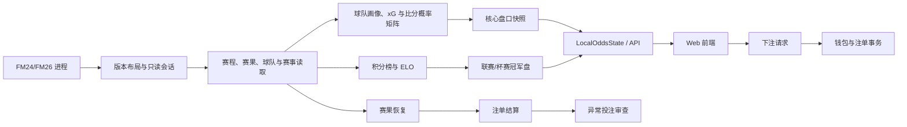

# FMODD 赔率系统架构

本文描述当前工作树中单场盘口、实时盘口、冠军盘、投注和结算的代码边界。它是赔率链路的维护入口，不替代 [`ARCHITECTURE.md`](ARCHITECTURE.md) 的全仓索引、[`RUNTIME_CONTRACTS.md`](RUNTIME_CONTRACTS.md) 的跨模块运行时规则，也不替代代码和测试。

## 1. 总体数据流

主链路遵循三个边界：

1. FM 内存只提供经过版本和对象身份校验的事实，不直接决定产品赔率。
2. 赔率模型只根据已发布的球队、赛事和赛果上下文生成价格，不拥有钱包或注单。
3. 下注和结算只接受服务端当前快照及持久化证据，不信任客户端传回的赔率和比赛状态。

## 2. 模块所有权

| 模块 | 负责 | 不负责 |
| --- | --- | --- |
| `fm_odds_web.py` | `LocalOddsState`、连接/刷新/结算编排、状态发布、下注入口和 HTTP 服务 | 底层概率算法、持久化格式、版本偏移真值 |
| `tools/local_state_services.py` | 刷新锁、取消、阶段发布、账户作用域绑定和应用服务编排 | FM 结构解析、钱包文件格式、盘口数学 |
| `tools/api_routing.py`、`tools/domain_errors.py` | 路由注册、统一分派和稳定错误载荷 | 业务计算 |
| `tools/game_layout.py` | FM24/FM26 与 Steam/Epic/XGP 的模块、RVA、vtable 和字段布局 | 产品级功能门禁和赔率参数 |
| `tools/game_session.py` | 常驻只读进程句柄、模块身份和会话代际 | 缓存易变的球队状态或赛果 |
| `tools/database_index.py` | Club、Competition、Nation、Person、Stadium、Team 等原生对象目录 | 盘口筛选和价格生成 |
| `tools/initial_data_audit.py` | 原生赛程、赛果、事件和基础对象解析 | 账户、风控和前端状态 |
| `tools/refresh_memory_core.py` | 固定/动态赛程池发现、结构校验、同 slab 补全和有界回退扫描 | xG、抽水和投注结算 |
| `tools/preview_cup_odds.py` | 当前核心赔率管线：读取窗口、赛程/赛果恢复、球队画像、xG、比分矩阵、单场市场和快照；保留结果历史兼容入口 | 钱包事务、处罚、HTTP 路由、历史文件生命周期实现 |
| `tools/odds_math_core.py` | 比分矩阵和亚洲盘权重的窄 Python 接口 | 业务状态和 FM 内存访问 |
| `tools/result_evidence.py` | 稳定场次身份、半场/首球明细一致性、明细清理和快照匹配；`preview_cup_odds` 保留兼容导出 | FM 读取、历史文件和盘口模型 |
| `tools/result_history.py` | 显式生涯路径下的赛果账本读取、旧来源合并、可信冲突优先级、明细继承、保留、备份恢复和原子保存 | FM 内存记录恢复、赔率模型和账户派彩 |
| `tools/odds_profiles.py` | 已提供阵容和近期赛果的纯画像、可出战筛选、分层 CA、体能锐度修正和位置诊断；原门面保留辅助函数兼容导出 | FM 读取、画像缓存生命周期、xG 定价和账户状态 |
| `tools/rust_native_core.py` / `fmodd_native_core` | 原生 Poisson/比分矩阵与市场权重计算、输入输出校验 | 版本选择、模型参数和盘口发布 |
| `tools/live_market.py` | 早盘、临场压力、轨迹和实时盘口输出 | 原生赛果读取和注单持久化 |
| `tools/league_standings.py` | 原生或赛果重建积分榜、赛事内 ELO、积分调整审计 | 冠军投注账户结算 |
| `tools/championship_odds.py` | 联赛/杯赛参赛者、冠军概率、快照、关闭条件和唯一冠军判定 | 单场盘口和钱包记账 |
| `tools/betting_account.py` | 钱包、注单、单关/串关/复式、退款、玩法判定和结算事务 | 生成比赛赔率、扫描 FM 内存 |
| `tools/money.py` | 最小货币单位整数换算、取整和兼容迁移 | 下注规则 |
| `tools/pass_methods.py` | 串关套餐组合与组合上限 | 单腿赛果判断 |
| `tools/match_integrity.py` | 异常投注证据、处罚、盘口停用和通知状态 | 普通注单结算和赔率模型 |
| `tools/season_ledger.py` | 赛季级核心预测归档 | 实时盘口发布 |
| `tools/save_context.py`、`tools/storage_*.py` | 存档/经理作用域、账户容器、缓存和保留策略 | 推导赔率或比赛结果 |
| `web/app.js` | 状态同步、盘口展示、投注单和局部交互 | 赔率真值、结算真值和风控判断 |

`live_market` 对由赛程身份和早盘价格决定的临场方向、强度和轨迹使用有界进程内缓存；由基础 xG 与舍入后临场胜平负唯一决定的比分概率面和完整详细盘口也使用独立的有界纯数学缓存。缓存只覆盖确定性派生值，不缓存钱包、FM 地址或赛果。清空 Python 进程后自然失效，盘口输入或模型版本改变时也不会跨进程复用。

## 3. 单场盘口生成

入口为 `tools.preview_cup_odds.generate_all_odds()`，当前支持完整刷新和快速刷新。

### 3.1 读取阶段

- 通过 `game_session` 借用只读 Reader，并由 `game_layout` 确认目标代际和发行版。
- 读取游戏日期、存档身份、人类经理、执教球队、赛事、赛程和已完成赛果。
- `2000…` 开头的赛事 ID 视为 FM 运行时/存档内可变身份，不得命中固定赛事类型或显示名映射；赛事名称取当前原生对象，赛制结构优先取已验证的原生阶段。
- 优先使用已验证的会话目录、固定池和缓存地址；结构不满足约束时才进入受限回退扫描。
- 所有缓存必须绑定存档作用域、进程/模块身份、会话代际和模型/设置版本。缓存存在本身不代表可信。

### 3.2 模型阶段

- `team_profile()` 只在未提供 `squad` 时读取一次阵容，再调用 `odds_profiles.build_team_profile()` 汇总球队强度、近期表现、士气与赛果 ELO 修正；显式空阵容也不触发补读。画像缓存仍由原管线按阵容/赛果签名维护，不把 FM Reader 或地址传入纯计算模块。积分榜与赛事声望继续由后续 xG 上下文组合。
- `expected_goals()` 生成主客队 xG，并处理主场、中立场、赛事基础进球水平及有限的上下文修正。
- 国家队资格赛（世界杯/欧洲杯等预选、资格或 qualifying 赛事）保留普通单场盘口，但不进入冠军盘：资格赛本身没有可结算的单一赛事冠军。赛事名称只是原生资格字段缺失时的保守后备，冠军盘排除原因保留在发现诊断中。
- 盘口刷新在 `performance.fixture_filter_counts` 暴露赛程候选的解析、对象/名称缺失、赛事排除、已开赛、超出发现/请求窗口、隐藏赛事、范围筛选、重复和最终建盘数量；这用于区分“没有赛程”和“赛程被某一层过滤”，不改变定价真值。
- `odds_math_core.score_matrix()` 生成比分概率矩阵。
- `build_match_odds()` 从同一矩阵生成胜平负、亚洲让球、大小球、双方进球、单双、率先进球、精确比分、半场和其他扩展市场。
- 可出战阵容按原始 CA 降序推定比赛名单：前 4 人作为球星层合计占 50%，第 5–11 人合计占 30%，第 12–22 人合计占 20%；不足 22 人时按已占用槽位权重归一化。单场盘口继续以 75% 原始分层 CA 和 25% 体能、锐度修正后的分层 CA 合成球队强度，冠军盘只消费原始分层 CA。该聚合复用现有最小阵容快照，不增加 FM 读取或扫描。
- 强弱差进入 `expected_goals()` 的常规线性区间后按每点 CA `0.0145` 的对数优势计算；对超过 50 CA 的极端错位仅增加一个独立、有上限的尾部修正，整体仍受 `0.825` 上限约束。该修正同时影响比分矩阵及其派生盘口，不直接硬编码让球线。模型版本变化时旧盘口快照按版本失效。
- 独赢与同队 `-0.5` 是同一结算事件；早盘、上下半场及临场盘口均以对应独赢的可执行价格作为唯一价格源，避免不同市场抽水与赔率阶梯取整造成 `0.01` 偏差。
- 全场胜平负目标抽水为 5.5%；其他单场市场在原有分层基础上统一小幅增加约 1 个百分点，比分盘目标返还率为 73%，冠军盘目标抽水为 20.5%。赔率阶梯取整会令单场展示值围绕目标轻微波动。
- 临场胜平负完成压力调整、赔率限幅和阶梯取整后，先归一化为唯一实时比分概率面；全场让球、大小球、球队大小球、双方进球、单双、首球、双重机会、净胜球、零封、比分和淘汰赛衍生盘均从该概率面重算，上下半场盘口从其实时进球期望投影重算。详细目录继续只在比赛已经展开或服务端验证下注时生成，页面展示与成交重定价必须消费同一实时目录。
- 模型版本与抽水参数由 `preview_cup_odds.py` 的 `MODEL_VERSION` 及常量控制，阵容分层与近期表现权重由 `odds_profiles.py` 持有并在原门面兼容导出。修改任一影响输出的模型参数时，必须评估模型版本、快照缓存和赛季账本兼容性；纯搬移且完整输出不变不需要改变模型版本。

### 3.3 发布阶段

- 刷新首先发布每场比赛的核心预测和基础元数据，`market_catalog_state=core`。
- 用户展开比赛后，`/api/match-markets` 按场生成详细盘口并标记为 `full`。
- 服务端状态使用 `data_scope_id` 区分存档作用域，使用 `data_version` 区分盘口版本。前端补丁只有同时匹配二者时才可合并。
- 旧页面发出的请求必须由服务端用当前时钟、盘口线和模型重新验证；客户端赔率不能作为下注真值。

## 4. 刷新与连接

### 4.1 连接

`LocalOddsState.startup_async()`/`connect_current_save()` 先建立轻量连接上下文：进程、日期、存档、经理和执教球队。连接成功不等于盘口刷新成功；盘口错误不得清空已经验证的玩家上下文。

### 4.2 完整刷新

完整刷新用于首次连接、跨存档、模型或设置变化、缓存不可信以及需要全量核对的情况。它允许重新发现赛程/赛果对象和重建必要画像，但仍应使用有界扫描和取消检查。

### 4.3 快速刷新

快速刷新复用同存档、同模型和同设置下的可信地址/快照，主要处理日期窗口滚动、轻量赛果和待结算订单。快速刷新不得绕过对象身份和存档作用域校验。

### 4.4 实时读取

- 有待结算注单时，后台只重读已定位的赛果对象和必要明细。
- 比赛引擎活动时可以只读捕获可信赛果，但结算仍受稳定确认、比赛身份和玩法明细完整性约束。
- 全私有内存扫描不属于高频路径。

## 5. 投注与结算

### 5.1 下单

`LocalOddsState.place_bet()` 和 `place_championship_bet()` 负责请求级校验，最终由 `betting_account` 在账户锁和持久化事务内预留资金、写入注单并记录服务端盘口证据。

必须校验：

- 当前连接、存档作用域和盘口版本；
- 游戏时钟、开球状态和比赛引擎限制；
- 比赛、市场、选项和盘口线仍存在；
- 服务端重算赔率、投注上限和潜在盈利上限；
- 钱包余额以及串关组合数量。

### 5.2 赛果证据

赛果按日期、赛事、主队和客队组成稳定身份；地址只是读取提示，不能单独作为比赛身份。半场比分、首个进球队伍、淘汰赛晋级方式等明细分别验证和持久化，一类缺失不能删除另一类已验证证据。

投注页的“之前”列表只展示具有可信赛前赔率的赛果。左侧导航第一层按日期倒序列出当前赛事范围内早于游戏日期、最近 7 个可用盘口日，选择日期后才在第二层显示全部、收藏、联赛、杯赛、国家队等赛事分类和具体赛事，再次点击已选日期时收起第二层；右侧只显示当前日期与赛事选择的交集。快照优先从比赛完成前最后一个已发布盘口复制；若刷新或重启时该比赛已离开当前盘口窗口，则按日期、赛事及主客队身份从当前赛季 `forecast_ledger.json` 恢复其最后一次已发布预测。账本的预测快照和场次元数据都保留 `kickoff_minutes` 与 `kickoff_time`，加载时兼容从场次元数据补回旧预测内缺失的时间；旧账本没有时间时，可从仍保留十五分钟时段的原生赛果日期码补回真实开球时间，日期码本身也没有时段时不做猜测。两条路径都会完整化原有盘口目录后固定为早盘，并只保留公开展示所需的球队画像字段；后续刷新继续携带该快照，不使用赛后阵容重新定价。每次成功盘口刷新都会归档当前已发布的核心预测，包括跨日 `schedule_rollover` 使用的快速刷新，因此跨日后即使旧比赛已经离开当前盘口窗口，仍能稳定恢复到“之前”列表。账本恢复会读取全部历史赛果的预测键以定位最近 7 个具有已发布预测的比赛日，但只为这 7 天重建详细盘口，避免启动时重建整季详细盘口。前端复用当前盘口组件、盘口文字和赔率格式，历史赛事保持只读，仅给按赛果结算为赢或半赢的赔率按钮增加绿色边框；球队名下显示不带单位的全场进球数，`vs` 下方只显示比分分隔冒号，不显示半场比分。精确进球滑块在首次渲染时按已验证的全场赛果自动定位；半场明细存在时再同步定位上下半场滑块，封顶区间仍使用现有 `X+` 档位。没有可信快照或已发布预测的旧赛果不伪造赔率，也不进入“之前”盘口列表。

### 5.3 结算

`betting_account.evaluate_leg()` 负责单腿玩法结果；`settle_pending_bets()` 负责普通注单事务；`settle_championship_bets()` 负责冠军盘。结算写钱包和注单必须原子化、可恢复、幂等，亚洲盘走盘/半赢/半输由结算层统一处理。

情报中心购买记录在最终单场赛果结算后由 `club_economy.reconcile_match_intelligence_refunds()` 复核。胜负、总进球数和比分情报分别与结算比分比较；不一致时按原购买流水的银行/钱包分账自动退款，并发送一封站内邮件。退款以原支付交易号和邮件 `source_id` 幂等，重复刷新、重启或重复结算不会再次入账。该保护只退情报费，不改变投注本身的输赢、派彩或结算状态。

串关与复式串关会为已经到达结算时间、且赛果证据及玩法明细完整的腿持久化 `partial_settlement`，供待结算注单即时显示赢、输、半赢、半输、走水和比分。该字段不改变整单 `status`、钱包或派彩；只有全部腿都满足原结算条件后，才由同一原子事务写入最终 `settlement`、总结算并清除临时腿状态。

银行页统一账本只读取并投影这些已提交的钱包交易；它不重新计算派彩、不补写交易，也不参与结算幂等判断。账单筛选、分类和分页的变化不得改变 `betting_account` 的钱包、注单或退款事务。

比赛结果可信但玩法所需明细缺失时，只保持相关腿待结算，不猜测、不自动退款。赛程消失、明确改期和长期无法恢复赛果分别走既定的退款/走水规则，不能混为一种状态。

### 5.4 风控

结算完成后，`match_integrity` 根据下注时固化的证据和已结算结果审查异常模式。风控可以停用盘口、生成处罚和通知，但不得重新解释普通结算结果或直接修改赔率模型。

## 6. 冠军盘

`championship_odds` 与单场盘口共享经过验证的赛事、球队、赛果、积分榜和画像事实，但拥有独立的模型版本、市场快照、关闭条件和冠军判定。

- 联赛赛季会在当前存档作用域保存最小结算账本（赛季键、赛季边界、参赛者和最新积分快照）。当前展示市场与历史结算市场分离；跨越赛季后，旧赛季只作为结算投影保留，不会混入新赛季投注列表。
- 当前积分榜绑定存档内选中的赛事赛季对象与其常规联赛阶段；跨赛季通过新的 `competition_season_address` / `actual_competition_address` 替换旧对象，新对象原生表为空时自然显示零。不得根据球队数量、双循环公式、赛季是否结束或“接近末轮”猜测总场数并清零旧表；尚未定位新赛季对象时也不得把旧表伪装成新赛季事实。
- 结算优先按下注时固化的 `season_key` 读取历史结算投影，不能因为当前页面已经切换到新赛季而改绑注单。

- 联赛优先使用当前赛季对象的有效原生积分榜；不可用时才按该赛季的已验证赛果重建。完整或快速刷新会重新校验同一存档中已保留的联赛赛季地址、赛事 ID 与原生实际赛事对象，并立即重读当前积分表，不等待赛季结束，也不预设应为 34 场。积分榜手动刷新还会扩大一次新赛季发现范围，使尚未进入盘口日期窗口的新赛季对象能够替换旧对象；结构读取与保留联赛重读不依赖冠军盘开关。对象身份不一致时拒绝更新，不按名义赛程推算比分或场次。
- 单循环/双循环积分表之后若存在恰好两队参加的同赛事淘汰附加赛，且两队都属于该常规积分榜，则按原生晋级/淘汰身份（缺失时才按同阶段可信赛果）更新两队最终排名；附加赛不增加积分榜的场次、胜平负、进失球、积分或 ELO。任一参赛队不属于同一张积分榜时视为跨联赛升降级附加赛，保持各自联赛排名不变。
- “最后一场赛果”只有在单阶段联赛结构已验证、赛程场次符合预期时才可作为终结依据。原生阶段包含附加赛/淘汰赛，或实际场次超出名义赛程时，常规赛数学锁定不得提前结算，必须等待原生终结阶段及其确认赛果。
- ELO 是冠军概率和单场模型的上下文，不覆盖原生积分榜事实。
- 杯赛参赛者和轮次来自原生阶段/淘汰赛结构，不能仅按赛事名猜测。决赛必须是最后原生淘汰阶段的最后一轮且仅一组对阵；季军赛和半决赛不满足此身份。复用已解析的同赛季赛程头恢复窗口外决赛，两回合取决定晋级的次回合，最终冠军必须来自原生晋级/淘汰证据，不能只用次回合比分。
- 当前市场以所选原生赛季的开赛日期绑定赛季窗口；已验证的原生参赛人数覆盖著名赛事的静态默认值。旧杯赛仅供历史结算，原生对象换代时保留待结算证据；同一赛季标签内确认出现另一开赛日期的赛事时使用带日期的独立赛季键。
- 有待结算冠军注单时，缓存清理保护联赛账本与杯赛决赛快照；关闭冠军盘显示不停止已有注单的赛果追踪及结算。游戏时刻参与市场依赖键，当前或历史决赛待赛果时不复用市场发布缓存。
- 旧错误赛季键仅在赛事 ID 和下注日期能唯一匹配完成市场时兼容结算；常规赛季窗口覆盖首场比赛前的下注，但带日期的同年新赛事不能追溯匹配其开赛前的旧注单。
- 冠军盘只有在赛季完成且唯一冠军证据成立后结算；模型领先者不是冠军事实。

积分榜事实仍由 `tools/league_standings.py` 提供。其 LRU 上限 8 的缓存只保存绑定存档作用域、FM 布局、游戏日期、赛季/实际赛事对象身份、各赛事推断赛季起点、赛果/阶段、原生积分榜快照、赛事声望和全部积分调整记录的公共投影，并在命中时返回副本；赛季对象替换或积分调整变化必须形成新依赖键。`tools/championship_odds.py` 保留现有按市场版本管理的价格/市场缓存，不能反向定义当前积分榜、把旧表按理论场数清零，或重复实现第二套冠军盘缓存。以上优化不改变冠军判定、盘口关闭、下注时价格核对或结算条件。

## 7. 持久化边界

`ResultHistoryOwner` 持有明确生涯 ID 与新旧账本路径，在共享锁及文件锁内完成保存的读—合并—写。`preview_cup_odds` 的 `read_result_history`、`merge_result_history`、`save_result_history` 保留原签名，并动态传递兼容入口的读取/合并回调。`recover_persistent_results` 仍属于 FM 内存记录恢复，不是磁盘账本读取。账本提取不改变存储格式、保留期限、待结算引用保护或空间预算策略。

| 数据 | 位置/所有者 | 规则 |
| --- | --- | --- |
| 钱包、注单、处罚、物品等账户数据 | `saves/<storage-scope>.fmodd` / 账户存储层 | 原子替换、作用域绑定、未来 schema 失败关闭 |
| 跨存档投注统计 | `tools/global_statistics.py` 的按需只读投影 | 只汇总已登记账户的已结算注单；不合并余额或未结算资金，不改变结算真值 |
| 可重建盘口和模型快照 | `cache/<storage-scope>/` | 必须校验存档、模型、设置和会话身份 |
| 生涯赛果历史 | `careers/<career-id>/result_history.json` | 作为跨账户的赛果证据账本，不属于临时盘口缓存 |
| 赛季预测账本 | `season_ledger` | 每次成功盘口刷新都归档核心预测，详细市场仅在已生成时可选保存 |
| FM 内存地址 | 仅当前进程/会话 | 不得跨 PID、模块身份或会话代际当作权威地址复用 |

## 8. 修改路由

| 需求 | 首选修改位置 |
| --- | --- |
| 调整 xG、球队权重或抽水 | `preview_cup_odds.py`；纯矩阵算法进入 `odds_math_core`/原生核心 |
| 新增单场玩法 | 市场生成放 `preview_cup_odds.py`，单腿判定放 `betting_account.py`，UI 放 `web/app.js` |
| 修改实时赔率 | `live_market.py` |
| 修改冠军概率/冠军判定 | `championship_odds.py`，积分/ELO 事实放 `league_standings.py` |
| 修改刷新策略 | `local_state_services.py` 与 `LocalOddsState`；底层扫描放 `refresh_memory_core.py` |
| 新增 FM 字段/结构 | `game_layout.py` 与读取层；不得塞入赔率公式 |
| 修改钱包、退款、派彩 | `betting_account.py`、`money.py` |
| 修改异常投注规则 | `match_integrity.py` |
| 修改前端展示/交互 | `web/`；服务端仍保持全部真值校验 |

新增功能不要默认继续扩大两个大文件：

- `fm_odds_web.py` 只保留跨领域状态门面和薄用例入口；可独立测试的刷新/账户编排优先进入 `local_state_services.py`。
- `preview_cup_odds.py` 目前仍同时承载读取、恢复、模型和定价。纯数学、纯解析或独立持久化逻辑应进入现有窄模块；大规模拆分必须单独立项并保持快照/结算兼容。

## 9. 验证路由

先运行与改动最接近的测试：

| 改动 | 重点测试 |
| --- | --- |
| xG、权重、价格阶梯 | `test_odds_model_weighting.py`、`test_odds_price_ladder.py` |
| 纯画像与读取边界 | `test_odds_profiles.py`：完整输出指纹、输入不变、Reader 调用次数和独立导入；下游权重与价格见上项 |
| 亚洲盘与详细市场 | `test_asian_handicap_market.py` |
| 刷新、缓存和状态版本 | `test_odds_auto_refresh.py`、`test_refresh_optimization.py`、`test_state_payload_optimization.py` |
| 赛程池和赛果恢复 | `test_fixture_pool_optimization.py`、`test_pending_result_search.py`、`test_knockout_results.py` |
| 注单和结算 | `test_result_settlement_regressions.py`、`test_betting_profit_limits.py`、`test_betting_account_messages.py` |
| 赛果证据与历史账本 | `test_result_evidence.py`、`test_result_history_owner.py`、`test_result_retention_defaults.py`；按改动选择结算和冠军盘调用方回归 |
| 冠军盘 | `test_championship_odds.py`、`test_championship_lifecycle.py`；涉及原生轮次时选 `test_knockout_results.py` |
| 风控 | `test_match_integrity_patterns.py`、`test_referee_integrity_notifications.py` |
| 前端刷新恢复 | `test_frontend_refresh_recovery.py` |

涉及 FM 地址、对象身份、比赛引擎状态或 Hook 的修改，即使静态测试通过，也必须明确标记目标 build 的实机证据是否完成。

## 10. 当前结构判断

当前代码已经把原生数学、实时盘、冠军盘、账户结算、风控、路由和部分刷新协调拆成独立模块，但仍有两个集中点：

- `fm_odds_web.py` 同时承担状态门面、刷新/结算编排和大量非赔率产品业务；
- `preview_cup_odds.py` 同时承担内存读取、赛果恢复、球队画像、模型和市场生成。

因此后续应按“新逻辑进入责任模块、旧逻辑按独立任务渐进迁移”的方式收敛，而不是一次性重写。任何拆分都必须保持 API 状态契约、快照兼容、下注重定价和结算幂等性。

## 11. 性能与交互契约

性能优化必须保持盘口输出、下注重定价、结算、风控和 FM24/FM26 版本语义不变。当前实现采用以下边界：

### 11.1 后端确定性缓存

- `live_market` 缓存完全由比赛身份和早盘价格决定的临场画像、强度与轨迹，以及由基础 xG、舍入后临场胜平负和目录层级决定的纯数学概率面；两类缓存容量上限均为 8192。
- 缓存键必须覆盖全部语义输入；模型或输入变化会形成新键，进程退出后缓存自然失效。
- 钱包、注单、赛果、FM 地址、比赛引擎状态和其他易变事实不得进入该缓存。
- 赛果弹窗继续按需读取 `/api/results`，投注历史继续由 `public_bet_history()` 保留全部待结算注单和最新 500 笔已结算注单；手动退款资格、金额与手续费每次由服务端重读。三者都不得新增跨请求长缓存。

合成负载 `1200 场 × 30 次 market_output` 的同机复测由 `2.373310 s` 降至 `1.569331 s`，约减少 34% 重复计算。该结果只证明确定性计算路径的相对改善，不代表真实 FM 存档、HTTP、DOM 或 WebView 的端到端延迟。

### 11.2 公共状态构建

- 已验证存档的 `/api/state` 在救济、处罚和训练协调完成后只构建一次完整俱乐部经济快照；连接阶段仅钱包作用域可用时仍构建普通经济快照。
- `market_output` 使用锁内复制的必要比赛输入，在释放 `LocalOddsState.lock` 后生成；`last_public_state_metrics` 分别记录锁内、市场输出和总耗时。
- 公共状态读取包含到期事务和运行时协调，不能把整个响应按 `data_version` 缓存。优化必须针对可证明的重复构建或纯派生输出，并保持副作用顺序。

### 11.3 前端重复工作抑制

- 赛事列表签名覆盖 `data_scope_id`、`data_version`、筛选、选择状态和全部可见赛事字段；签名未变化时跳过整表 DOM 重建。
- 搜索输入通过 `requestAnimationFrame` 合并同一帧内的连续刷新，但筛选语义和最终结果不变。
- 实时报价为每场比赛生成一次报价签名，只在签名变化时更新节点；比赛索引用 `Map` 复用，避免重复线性查找。
- 投注主页以比赛键和赛事 ID 建立只读前端索引；新响应到达时精确比较完整导航内容，内容未变则沿用短版本号。赛事栏签名覆盖时钟、范围、赛事/日期选择、展开、收藏、隐藏赛事和冠军盘导航状态；投注单签名覆盖选择可见字段、赔率、盘口版本、投注方式、过关方式、注额、币种、可下注状态和提交状态。签名短路只抑制 DOM 写入，不能替代服务端可下注性、重定价、限额、幂等扣款或结算。
- `data_scope_id` 或 `data_version` 变化时清空赛事和实时报价签名，禁止跨存档或跨盘口版本复用前端缓存。
- `loadState` 复用正在执行的状态请求；多个 `fresh` 要求在当前请求结束后只合并为一次串行追加读取，避免并发触发重复的磁盘、内存和派生状态工作。
- 积分榜按赛事 ID 建立索引，冠军盘按赛季键、赛事 ID 和球队 ID 建立索引；两页只在数据对象替换时排序或重建索引。积分榜签名覆盖作用域、版本、刷新状态、显示数量、选择、执教球队和全部可见积分字段；冠军盘签名覆盖盘口版本、启用/刷新状态、隐藏赛事、展开状态、选择和全部可见球队字段。签名不变时跳过 DOM 重建，但同步状态仍通过 `aria-busy`/状态提示和键盘/ARIA 语义公开。
- 投注历史按注单 ID 建立待结算/已结算索引，赛果按日期、赛事和球队建立索引；数组对象替换时用完整内容签名决定是否提升短版本，相同内容的状态轮询不重建弹窗 DOM。历史签名覆盖作用域/版本、视图、分类、分析模式、游戏日期、币种和搜索赛果状态，赛果/日历签名覆盖范围、赛事、日期、收藏、隐藏赛事和分页。退款弹窗只复用注单索引显示文本，`available/refund/fee` 仍以最新服务端响应为准，前端签名不能替代退款校验、账户事务或结算。
- 近似负载下积分榜前端合成准备中位数由 `11.201 ms` 降至 `1.176 ms`，约减少 `89.5%`；后端积分榜公共投影热命中约 `6.754 ms`，相对原基线约减少 `50.9%`。这些基准只说明重复计算或 DOM 准备的相对变化，不代表真实 FM、HTTP 或 WebView 端到端延迟。
- 1200 场比赛、96 个赛事、10 个选择、2000 次不变渲染的赛事栏与投注单合成准备中位数由 `89.743 ms` 降至 `29.816 ms`，约减少 `66.8%`。该基准不包含真实 DOM、HTTP、FM 读取、服务端下单或 WebView 绘制，也不证明下注链路更快。
- 520 笔注单、5000 场赛果、500 次不变准备的历史/赛果合成中位数由约 `247.642 ms` 降至 `1.264 ms`，约减少 `99.5%`。该基准不包含真实 DOM、HTTP、账户存储、退款事务、FM 读取或 WebView 绘制，也不证明结算或退款链路更快。

### 11.4 视觉反馈

日期分组、赛事行、赔率按钮、选中状态、详细盘口和键盘 `focus-visible` 提供一致的层级反馈。公共状态同步超过 160ms 时在顶部显示非阻塞“同步中”状态，短请求不显示以避免闪烁。动画和悬停反馈必须尊重 `prefers-reduced-motion`；视觉调整不改变 DOM 业务语义、盘口状态或文案规则。

任何后续响应优化仍应先记录可重复基线，再改动最窄热点并用同一负载复测。静态和合成测试通过后，仍需单独记录匹配版本 FM 进程、真实存档和桌面 WebView 的实机延迟证据。
